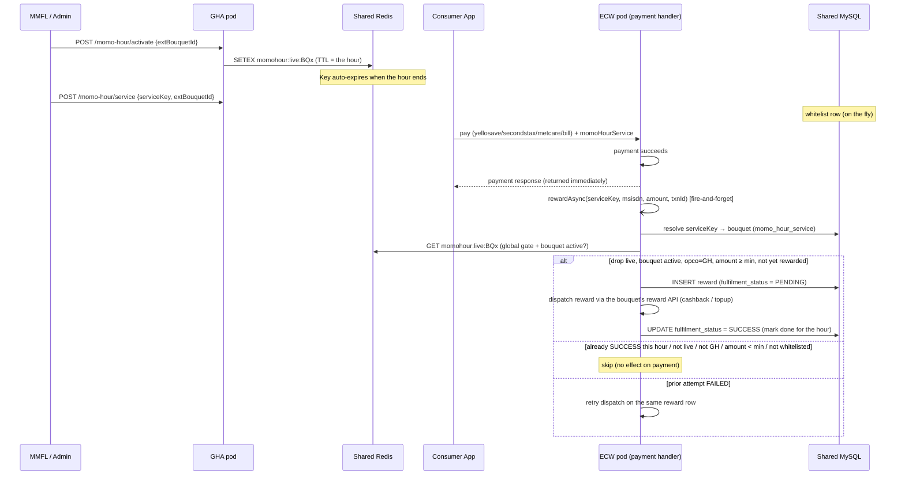

# MoMo Hour Admin Portal

A standalone Next.js web UI for administering the MoMo Hour reward campaign
feature - everything that was previously only reachable via raw HTTP calls
(see `docus/MOMO-HOUR.md` and `docus/postman/MoMo-Hour.postman_collection.json`
at the repo root). Covers:

- **Bouquets** - view/create/edit bouquets, see which services are whitelisted
  under each, and check a bouquet's real-time live status on demand
- **Services** - the full serviceKey → bouquet whitelist, add/edit entries
- **Schedule** - create date + hour-range drop schedules (every drop is a
  fixed 60 minutes), with clear handling of time-slot conflicts, and
  enable/disable a not-yet-live slot to cancel it
- **Drops** - view the currently active drop, manually activate/end one, and
  a manual reward-trigger tool for testing
- **Rewards** - browse reward history, search by MSISDN
- **Admin Accounts** (super admin only) - create admin accounts and toggle
  exactly which of the above each one can do

There is no in-portal request/response log - that would need its own DB
table, which was deliberately dropped to avoid the extra storage/writes.
Reward-engine decisions (including in-process checks like `buyAirtime`,
which never go over HTTP) are visible in the **ECW console/application
logs** instead - look for `MoMoHour rewardAsync ...` and
`MoMoHour processReward rejected: ...` lines.

This app talks directly to the GHA pod's `POST /momo-hour/*` API. It does
**not** call ECW or CIS directly.

## Running locally

```bash
cd momo-hour-portal
npm install
cp .env.local.example .env.local   # defaults to http://localhost:3000 (local GHA)
npm run dev                         # serves on http://localhost:3100
```

Requires a running GHA instance reachable at the configured base URL.

## Pointing at a different server

The base URL is **not baked in at build time** - `NEXT_PUBLIC_GHA_BASE_URL`
is only the default shown on first load. Open **Settings** in the portal to
point it at any environment (dev/uat/prod GHA base URL); the choice is saved
in the browser (`localStorage`) and reused on every request until changed.
This means a single deployed instance of this portal can administer MoMo
Hour on any environment without a rebuild.

## "Enabled/Disabled" vs "LIVE" - read this before it confuses you

The DB `status` field on bouquets/services/schedules (`ACTIVE`/`INACTIVE`) is a
**permanent whitelist flag** - it says nothing about whether a drop is
actually running right now. The portal deliberately labels it **"Enabled"/
"Disabled"** everywhere (`StatusBadge` in `src/components/ui/Badge.tsx`) so
it can't be misread as "live." The word **"LIVE"** is reserved exclusively
for the real-time drop state - the Dashboard, the Drops page, and the
"Check live status" button on each Bouquet card. A bouquet/service can sit
"Enabled" for months with no drop ever live; a payment only earns a reward
when both are true at once: its service is Enabled *and* its bouquet has a
live drop at that exact moment (see `docus/MOMO-HOUR.md` §2a).

Relatedly, the Schedule page only offers the Enable/Disable toggle for
today/upcoming slots - a past date can never self-activate again regardless
of its status, so the control is hidden there rather than left as a
do-nothing button.

## Signing in — per-admin login, not a shared secret

`GHA/src/auth/auth.middleware.ts` lists `/momo-hour` in `urlExceptions`
specifically so an external portal (this one) can call it without a
mobile-app JWT/session - see `docus/MOMO-HOUR.md` §5. In its place,
`MomoHourAuthGuard` requires a per-admin login: sign in with an email +
password (super admin, or an admin account created under **Admin
Accounts**), and the portal attaches the resulting JWT to every
`/momo-hour/*` request as `Authorization: Bearer <token>`. Full design in
[`docus/MOMO-HOUR-RBAC.md`](../docus/MOMO-HOUR-RBAC.md).

The session is deliberately kept **in memory only for the current tab**
(`src/lib/auth.tsx`) - unlike the base URL, it is never written to
localStorage, so a reload or a new tab requires signing in again. Different
admins can be granted different permissions (see the **Admin Accounts**
page, super-admin only) - a 403 from GHA means the signed-in account lacks
that specific permission, not that something's broken. Still restrict who
can reach the base URL at the network/deployment layer (VPN, IP allowlist,
internal-only ingress) as a second layer regardless of who's allowed to
sign in.

## Two required request rules

Every request to GHA's `/momo-hour/*` routes must (enforced globally by
`AuthMiddleware`, independent of this portal):
1. Carry a **non-empty JSON body** - list/read calls with no real params send
   a `{ "source": "momo-hour-portal" }` placeholder, exactly like the Postman
   collection does.
2. Carry a **`metadata` header**. The middleware only checks presence, but some
   downstream logging/analytics reads fields out of it, so this portal sends a
   realistic mobile-app-shaped payload (`src/lib/metadata-header.ts`) rather than
   an empty placeholder.

The API client in `src/lib/api.ts` handles both automatically; you shouldn't
need to think about this when adding a new page/call.

## Complete Documentation

# MoMo Hour

> Time-boxed, gamified cashback/reward campaign. During a live "Drop" (a
> 60‑minute window) an eligible payment on a whitelisted service rewards the
> customer - a 1:1 cashback match capped at **GHS 100** per customer per Drop,
> on the **first eligible transaction only**.
>
> **Ghana (GH) opco only.** GHA is GH‑only, and the ECW reward trigger is
> guarded so it never fires for any other opco.

MoMo Hour spans **two pods** that share the same MySQL database and the same
Azure Redis instance:

| Pod | Stack | Responsibility |
|-----|-------|----------------|
| **GHA** | NestJS (`GHA/src/momo-hour/`) | Campaign admin (bouquets, **date‑based schedules**, **service whitelist**), manual **drop activation/ending**, and enforcing that only one bouquet's drop is live at a time. |
| **ECW** | Express (`ECW/src/momoHour/`) | **Reward fulfilment**, plus **lazy self‑activation** - the highest‑traffic path (payments) activates a scheduled drop itself the moment it's due, no cron and no admin action required. |

The key mechanism: **either pod can write the live‑drop key → ECW reads it.**
GHA writes it for a manual `POST /momo-hour/activate`; ECW writes it itself
when a scheduled slot is due but nothing is live yet (see §2a). Because both
pods point at the same Redis and MySQL, no extra transport is needed for
state, and a shared Redis lock (`momohour:activation:lock`) keeps the two pods
from racing each other when both reach for activation at once.

**Where the reward is triggered.** Most whitelisted payments (Yello Save,
Metcare, Belnsured, bill payments, …) execute on **ECW** `commision/*`
endpoints or ECW-native routers - GHA only calls them. So the reward is
triggered **on ECW, at the payment success point, as a fire‑and‑forget async
call** that never blocks or breaks the payment. A handful of services (Ayo,
MiWay, Sanlam‑Allianz) charge the customer directly through a third‑party
vendor with no ECW wallet debit at all - for those, GHA calls its own manual
`triggerReward` right after the vendor confirms success (§6, Pattern 3). See
§8a for the full list of eligible APIs and which pattern each uses.

**Eligibility is decided server‑side, never trusted from the client.** Every
wired service **hardcodes its own fixed `serviceKey`** before calling ECW (or
GHA's `triggerReward`) - it is never read off the mobile app's request
payload. ECW then maps that key to a bouquet via the `momo_hour_service`
table (admin‑managed, `POST /momo-hour/service`), so a service can be
whitelisted **on the fly with no code change**, but *which* key a given
endpoint sends is fixed in code, not client‑controlled. See §6 for why.

---

## 1. The 5 Bouquets

Each bouquet is a category of eligible services. A Drop activates exactly one
bouquet at a time. The authoritative eligible-service list is
`MoMo_Hour_Eligible_Services_API.csv`; §8a maps every row in it to its
hardcoded `serviceKey`, implementing pod/file, and wiring status.

| Code | Bouquet | Eligible services (MoMo Hour) |
|------|---------|-------------------------------|
| `BQ1` | **Protection** | Airtime (self/others) - wired. Data Bundle (fixed/flexi/video, CIS) and Broadband (MADAPI) - **blocked**, see §8b. |
| `BQ2` | **Future Planning** | Group Save, Sika Save, Yello Save (`make-deposit`) - wired. |
| `BQ3` | **Payments** | P2P (`/sendmoney/momo`), Merchant (`/scan/paymerchant`), Bill Payment (`/billpayment/payment`) - wired. |
| `BQ4` | **Be a Pro** | Insurance: Ayo, Belnsured, Dosh\*, Metcare, MiWay, Sanlam‑Allianz. Investment: Grow For Me, IC Liquidity, Trade Shares, Tesah Capital, Digi Save. Pension: Personal Pension (Flexi), My Own Pension (MOP). All wired except Dosh (\*not yet - see §8a). **Second‑Stax investment is explicitly excluded (staff‑only, not eligible).** |
| `BQ5` | **Lending** | Loan Repayment (Jumo, via PWA) - **blocked**, see §8b. |

Bouquets are stored as rows keyed by `ext_bouquet_id` (`BQ1`…`BQ5`). A bouquet
flipped to `INACTIVE` is never activated and never rewards, even if a schedule
slot is otherwise live.

---

## 2. Reward Flow



**Business rules enforced in `ECW/src/momoHour/rewardEngine.js` (`processReward`)
and the async guard `ECW/src/momoHour/trigger.js` (`rewardAsync`):**

0. **GH only** - `rewardAsync` skips any opco other than `GH`.
1. **Live‑hour gate** - the Drop must be live in Redis (`getLiveDrop`). Reward is
   only possible *during the hour*. This is the single global gate every path
   passes through, so Redis is always checked.
1b. **Specific bouquet active** - for every transaction the *resolved* bouquet id
   is validated: an `INACTIVE` (or mismatched) bouquet is rejected
   (`BOUQUET_INACTIVE` / `BOUQUET_MISMATCH`) even if a live key still exists.
2. **Minimum amount** - the eligible transaction amount must be **≥
   `MOMO_HOUR_MIN_AMOUNT`** (default **1**; set to `0.01` to reward any amount
   greater than 0). Quotes carry no transaction id and are skipped.
3. **One successful reward per customer per Drop** - enforced by the MySQL unique
   key `(drop_id, msisdn)` plus a fast Redis marker. Only a **successful**
   fulfilment closes the door: a repeat transaction in the same hour returns
   `ALREADY_REWARDED`. A prior **FAILED** attempt is **retried** on the same row;
   an in‑flight `PENDING` one returns `IN_PROGRESS` (no double credit).
4. **Cashback cap** - `min(amount × match_ratio, cap_amount)` (default 1:1,
   capped at **GHS 100**). Non‑cashback bouquets use the bouquet's fixed
   `reward_value`.
5. **Fulfilment status (per msisdn per Drop)** - the reward row is written
   `PENDING`, then updated to **`SUCCESS`** once the credit is dispatched (or
   `FAILED` on dispatch error). The Redis marker is set **only on `SUCCESS`**, so
   the "don't reward again this hour" gate tracks *successful* fulfilment, not
   merely an attempt.

---

## 2a. Single Active Bouquet, Lazy Self‑Activation & Auto‑Clear

**Only one bouquet may be live at a time.** `momo_hour_active_drop` (shared
MySQL) holds at most one `status='ACTIVE'` row. `POST /momo-hour/activate`
rejects (`ANOTHER_DROP_ACTIVE`) rather than replacing it - an admin must wait
out the current hour or call `POST /momo-hour/end` first.

**Drops start themselves - no cron.** A schedule slot
(`momo_hour_campaign_schedule`: a specific `campaign_date` + `start_hour`/
`end_hour`) doesn't activate on its own at the clock tick. Instead, the first
real request that lands during the window activates it lazily:

- **ECW** - `rewardEngine.resolveLiveDrop(extBouquetId)` is what `processReward`
  (every payment) and the `/momohour/active` status handler now call instead of
  a raw Redis `GET`. On a hit it's unchanged - one `GET`, nothing else. On a
  miss it checks a 30s per‑bouquet negative‑cache (`momohour:noschedule:{extBouquetId}`)
  to avoid hammering MySQL during dead hours, takes a short Redis lock
  (`momohour:activation:lock`), and if a schedule slot for that bouquet is due
  *right now*, writes the live‑drop key itself, inserts the
  `momo_hour_active_drop` row, and returns the drop so the *same* request's
  reward proceeds immediately.
- **GHA** - `POST /momo-hour/activate` remains available as a manual override
  (testing, or starting a drop outside any schedule row) and now also inserts
  into `momo_hour_active_drop` and takes the same lock.

> **This means an admin *check* is also a legitimate trigger, not just a
> payment.** `MomoHourService.getActive` (`GHA/src/momo-hour/momo-hour.service.ts`)
> proxies to ECW's `POST /momohour/active` (the same `resolveLiveDrop` path a
> real payment exercises) instead of only reading Redis/DB directly, and
> `getCurrentActiveDrop` sweeps every `ACTIVE` bouquet through it when nothing
> is currently active. Without this, viewing the admin portal's Dashboard/Drops
> page - which only ever talks to GHA - could never itself flip a due schedule
> live; it would sit invisible until real ECW-side traffic (a payment, or a
> direct `POST /momohour/active`) happened to land. Now simply loading the
> dashboard is enough.

**Drops end themselves too - lazy cleanup, no cron.** Whichever request next
notices the active row's `end_at` has passed closes it out before doing
anything else: `momo_hour_reward_history.active` is set to `0` for every row
of that `drop_id` (the customer's benefited‑bouquet **history is preserved**,
just no longer counted as "current"), the active‑drop row flips to `ENDED`,
and the Redis live key is deleted outright rather than waiting on its TTL.
This runs inside `cleanupIfExpired()` (GHA: `activateDrop`, `getActive`,
`getCurrentActiveDrop`) and the equivalent branch of `resolveLiveDrop` (ECW).
An admin can also force this early via `POST /momo-hour/end`.

> **Timezone bug (fixed):** `campaign_date`/`start_hour`/`end_hour` are local
> wall-clock values everywhere in this feature (how an admin enters them, how
> MySQL's `CURTIME()`/`CURDATE()` compare them, how `new Date()` compares
> against them) - so `resolveLiveDrop`'s `combineDateAndHour` (ECW) must build
> its `endAt` using the process's own local time, never UTC. A previous
> version forced UTC via a trailing `Z`, and separately extracted a MySQL
> `DATE` value's calendar day via `.toISOString()` (also UTC) even though
> mysql2 returns that `Date` built from LOCAL calendar fields - on any host
> whose timezone is ahead of UTC (e.g. local dev on `Africa/Lagos`, UTC+1)
> both mistakes pushed `endAt` into the past, so **every** self-activation
> failed with `NO_LIVE_DROP` regardless of the actual time of day, not just
> near midnight. The equivalent "is this schedule elapsed" check in GHA's
> `updateScheduleStatus`, and the portal's own `today` computations (Dashboard,
> Schedule form/list), had the narrower version of the same mistake (mixing
> `toISOString()` UTC dates with local hour comparisons), wrong only for the
> hour spanning local midnight - also fixed, via a shared `localDateString()`
> helper (`momo-hour-portal/src/lib/date.ts`).

---

## 3. Redis Keys (shared)

| Key | Producer | Consumer | TTL | Purpose |
|-----|----------|----------|-----|---------|
| `momohour:live:{extBouquetId}` | GHA (`activateDrop`) or ECW (`resolveLiveDrop` self‑activation) | ECW (`getLiveDrop`, reward engine) | always 3600s - every drop is a fixed 60 minutes, not configurable | The live‑drop config. Its expiry (or an explicit delete on cleanup/`/end`) closes the reward window. |
| `momohour:reward:{dropId}:{msisdn}` | ECW (`markRewarded`, on SUCCESS only) | ECW (`isAlreadyMarked`) | 3600s | Fast “already successfully rewarded this hour” marker; DB `fulfilment_status = SUCCESS` is the source of truth. |
| `momohour:activation:lock` | GHA (`activateDrop`/`endDrop`) or ECW (`resolveLiveDrop`) | same | 5s | Short cross‑pod mutual exclusion so two concurrent requests never both try to activate/clean-up the single active drop. |
| `momohour:noschedule:{extBouquetId}` | ECW (`resolveLiveDrop`) | ECW (`resolveLiveDrop`) | 30s | Negative cache: "nothing was due for THIS bouquet on the last schedule lookup," so a request storm during dead hours costs at most one DB lookup per bouquet per ~30s. **Keyed per-bouquet, not a single global key** - an earlier bug used one shared key, so a not-yet-due bouquet (e.g. checked by the admin dashboard's activation sweep) would poison the cache for every other bouquet too, including one genuinely due right now. |
| `momohour:servicekey:{serviceKey}` | ECW (`dal.getBouquetForService`) and GHA (`resolveServiceKeyBouquet`, used by `triggerReward`); invalidated by either pod's `upsertService` | ECW (every whitelisted `commision`/`sendMoney`/`billPayments`/`scanPayment`/`topUpServices` payment) and GHA (`triggerReward` - Ayo/MiWay/Sanlam‑Allianz) | 3600s | Caches the serviceKey→bouquet resolution (or a `__NONE__` sentinel for "not whitelisted") so the highest-traffic lookup in the whole feature isn't a MySQL `SELECT` per transaction. Deleted immediately on any whitelist change (both pods call this on `upsertService`), so admin edits are visible on the very next request regardless of the TTL - the long TTL is just a staleness backstop, not the primary consistency mechanism. |

Live‑drop JSON payload:

```json
{
  "dropId": "…",
  "extBouquetId": "BQ1",
  "name": "Protection",
  "category": "…",
  "status": "ACTIVE",
  "rewardType": "cashback",
  "rewardValue": 0,
  "matchRatio": 1,
  "capAmount": 100,
  "startAt": "ISO",
  "endAt": "ISO"
}
```

---

## 4. Database Schema (shared MySQL `mtn_momo`)

Tables are created idempotently by the ECW DAL (`ensureTables()`,
`CREATE TABLE IF NOT EXISTS`) on first use. GHA runs with `synchronize: false`
and reads/writes the same tables via TypeORM entities
(`GHA/src/momo-hour/entities/`).

> **`status` (`ACTIVE`/`INACTIVE`) terminology note:** on `momo_hour_bouquet`,
> `momo_hour_service`, and `momo_hour_campaign_schedule`, `status` is a
> **permanent whitelist/enable flag** - it says nothing about whether a drop
> is live *right now*. A bouquet or service can sit `ACTIVE` for months with
> no drop ever live. The only thing that means "live right now" is the
> `momohour:live:{extBouquetId}` Redis key / `momo_hour_active_drop`'s
> `ACTIVE` row (§2a, §3) - a payment only earns a reward when *both* are true
> at once. To avoid this exact confusion, the admin portal
> (`momo-hour-portal/`) deliberately labels this flag "Enabled"/"Disabled" in
> its UI and reserves the word "LIVE" for the real-time drop state.

### `momo_hour_bouquet`

| Column | Type | Notes |
|--------|------|-------|
| `id` | INT AI PK | |
| `ext_bouquet_id` | VARCHAR **UNIQUE** | `BQ1`…`BQ5` |
| `name` | VARCHAR | |
| `category` | VARCHAR | |
| `reward_type` | VARCHAR (default `cashback`) | `cashback` \| `airtime` \| `data` \| `voice` |
| `reward_value` | DECIMAL | fixed value for non‑cashback |
| `match_ratio` | DECIMAL (default `1.00`) | cashback multiplier |
| `cap_amount` | DECIMAL (default `100.00`) | per‑customer per‑drop cap |
| `start_date` / `end_date` | DATETIME | |
| `status` | VARCHAR (default `ACTIVE`) | `ACTIVE` \| `INACTIVE` |
| `created_at` / `updated_at` | DATETIME | |

### `momo_hour_campaign_schedule`

MoMo Hour runs on a **specific calendar date**, not a recurring day‑of‑week.
Every slot is a **fixed 60 minutes** - `end_hour` is always `start_hour + 60m`,
computed server-side in `MomoHourService.createSchedule` and never taken from
the caller (a `startHour` after `23:00` is rejected with
`reason: 'START_HOUR_TOO_LATE'`, since a drop can't cross midnight). Multiple
slots can share the same `campaign_date` as long as their hour windows don't
overlap - overlap is checked in application code, not by a DB constraint,
since "only one drop live at a time" is already enforced separately at
*activation* (`activateDrop`'s `ANOTHER_DROP_ACTIVE` rejection), not at
scheduling time. A genuine overlap on `POST /momo-hour/schedule` returns
`{ created: false, reason: 'TIME_SLOT_CONFLICT', schedule: <conflicting row> }`
so the caller can see exactly what it collided with.

| Column | Type | Notes |
|--------|------|-------|
| `id` | VARCHAR(64) PK | UUID |
| `ext_bouquet_id` | VARCHAR | FK-ish to bouquet |
| `campaign_date` | DATE | specific date the drop runs, e.g. `2026-07-25` |
| `start_hour` / `end_hour` | VARCHAR(5) | `"18:00"` / `"19:00"` |
| `status` | VARCHAR | `ACTIVE` \| `INACTIVE` |
| `created_at` | DATETIME | |

No DB-level uniqueness on `(campaign_date, start_hour)` — a concurrent
double-submit is instead guarded by a Redis lock (`withScheduleLock` in
`MomoHourService.createSchedule`).

> **Migration note:** this table went through two DB-level unique constraints
> before landing here — first `UNIQUE(campaign_date)` alone (one schedule per
> day, no exceptions), then `UNIQUE(campaign_date, start_hour)`
> (`uq_momo_hour_schedule_date_hour`). The second one was dropped because a
> plain unique index can't distinguish by `status`, so it wrongly also
> blocked reusing a DISABLED slot's old time window — the exact "cancel one
> bouquet at 12:00–13:00, schedule a different one at the same time" case now
> works. Local dev (`synchronize:true`) picks this up automatically on next
> boot. **Production runs `synchronize:false`**, so the old index has to be
> dropped manually there:
> ```sql
> ALTER TABLE momo_hour_campaign_schedule DROP INDEX uq_momo_hour_schedule_date_hour;
> ```

### `momo_hour_reward_history`

| Column | Type | Notes |
|--------|------|-------|
| `id` | VARCHAR(64) PK | UUID |
| `drop_id` | VARCHAR | the active Drop |
| `ext_bouquet_id` | VARCHAR | |
| `msisdn` | VARCHAR | rewarded customer |
| `sending_fri` / `receiving_fri` | VARCHAR | OVA → customer |
| `source_transaction_id` | VARCHAR | the eligible debit |
| `reward_transaction_id` | VARCHAR | the credit txn |
| `reward_type` | VARCHAR | |
| `reward_value` | DECIMAL | |
| `amount` | DECIMAL | eligible amount |
| `status` | VARCHAR (default `applicable`) | `success` \| `failed` |
| `fulfilment_status` | VARCHAR (default `PENDING`) | **flips to `SUCCESS`** |
| `active` | TINYINT(1) (default `1`) | `1` while counted toward its (currently live) drop; flipped to `0` when that drop ends. The row and `fulfilment_status` are never touched, so a customer's reward **history stays fully queryable** (`POST /momo-hour/rewards`) regardless of this flag. |
| `created_at` | DATETIME | |
| **UNIQUE** | `(drop_id, msisdn)` | enforces first‑eligible‑only |

### `momo_hour_active_drop` (single live drop)

Tracks **the** currently‑active drop - at most one `status='ACTIVE'` row at any
time, enforced in application code (both `MomoHourService.activateDrop`/
`endDrop` on GHA and `rewardEngine.resolveLiveDrop` on ECW check/write this
table under a shared Redis lock). When a drop ends (its `end_at` passes, or an
admin calls `/momo-hour/end`), the row flips to `ENDED` and every
`momo_hour_reward_history` row for its `drop_id` is reverted to `active = 0`.

| Column | Type | Notes |
|--------|------|-------|
| `id` | INT AI PK | |
| `drop_id` | VARCHAR(64) **UNIQUE** | matches `momo_hour_reward_history.drop_id` |
| `ext_bouquet_id` | VARCHAR | the bouquet this drop is running for |
| `start_at` / `end_at` | DATETIME | the live window |
| `status` | VARCHAR (default `ACTIVE`) | `ACTIVE` (at most one row) \| `ENDED` |
| `created_at` / `updated_at` | DATETIME | |

### `momo_hour_service` (dynamic whitelist)

Maps an eligible payment service (api name/path) to the bouquet it belongs to.
Rows can be added/removed at runtime, so services are whitelisted **on the fly**
with no code change. Created idempotently by ECW `ensureTables()`; read by the
reward engine and read/written by the GHA `MomoHourServiceMap` entity.

| Column | Type | Notes |
|--------|------|-------|
| `id` | INT AI PK | |
| `service_key` | VARCHAR **UNIQUE** | hardcoded per-service slug the server sends, e.g. `yellosave`, `belnsured`, `trade-shares`, `ayo` - see §8a for the full list. Never `secondstax` (explicitly excluded, §8a). |
| `ext_bouquet_id` | VARCHAR | bouquet the service belongs to |
| `status` | VARCHAR (default `ACTIVE`) | only `ACTIVE` mappings are eligible |
| `created_at` / `updated_at` | DATETIME | |

---

## 5. Endpoints

> **All MoMo Hour endpoints are `POST`** - the mobile app does not allow `GET`.
> List/read operations use `POST .../list` (or a `POST` with the id/msisdn in the
> body). A ready‑to‑import Postman collection lives at
> [`docus/postman/MoMo-Hour.postman_collection.json`](postman/MoMo-Hour.postman_collection.json)
> with an environment file
> [`docus/postman/MoMo-Hour.postman_environment.json`](postman/MoMo-Hour.postman_environment.json).

### Authentication (GHA admin API - external portal access)

`GHA/src/auth/auth.middleware.ts` runs globally (`consumer.apply(LoggingMiddleware,
AuthMiddleware).forRoutes('*')` in `app.module.ts`) and normally requires the
mobile app's JWT/session cookie. Since the bouquet/schedule/activation API is
meant to be driven by the **external MMFL admin portal**, not the mobile app,
`/momo-hour` is listed in `AuthMiddleware`'s `urlExceptions` - any URL
containing it skips the JWT/cookie/session check entirely.

That whitelist only skips the *session* check. Two earlier, unconditional
gates in the same middleware still apply to every request, whitelisted or not:

1. **A `metadata` header must be present** - any value works (only
   `'metadata' in req.headers` is checked here), e.g. `metadata: {}`. Its
   absence 400s with `HEADERS MISSING` before the whitelist is ever reached.
2. **The JSON body must be non-empty** - `Object.keys(req.body).length === 0`
   400s with `Please pass request payload`, so a literal `{}` is rejected even
   for pure "list everything" calls. Send at least one placeholder field
   instead, e.g. `{ "source": "portal" }`.

The Postman collection (`docus/postman/MoMo-Hour.postman_collection.json`)
sends a `metadata` header and a non-empty body on every GHA request for this
reason - mirror that from the external portal.

### GHA - `@Controller('momo-hour')` (admin + activation)

| Method | Path | Body | Purpose |
|--------|------|------|---------|
| `POST` | `/momo-hour/bouquet` | UpsertBouquet | Create/update a bouquet |
| `POST` | `/momo-hour/bouquet/list` | `{}` | List bouquets |
| `POST` | `/momo-hour/schedule` | CreateSchedule `{ extBouquetId, campaignDate, startHour, status? }` | Create a schedule slot for a specific calendar date - every slot is a fixed 60 minutes, so `endHour` is computed server-side from `startHour` and is not a request field (`startHour` after `23:00` rejects with `reason: 'START_HOUR_TOO_LATE'`, since a drop can't cross midnight). Multiple slots may share a date as long as their hour windows don't overlap; a genuine overlap rejects with `{ created: false, reason: 'TIME_SLOT_CONFLICT', schedule: <conflicting row> }` instead of a raw duplicate-key 500 |
| `POST` | `/momo-hour/schedule/list` | `{}` | List schedules |
| `POST` | `/momo-hour/schedule/status` | `{ id, status }` | **Enable/disable a schedule slot** without deleting it - set `status: 'INACTIVE'` to cancel an upcoming slot so it can never self-activate (ECW's `findDueSchedule` only considers `ACTIVE` rows); set back to `'ACTIVE'` to re-enable. Does not touch an already-live drop - use `/momo-hour/end` for that. `{ updated: false, reason: 'SCHEDULE_NOT_FOUND' }` if the id doesn't exist; re-enabling a slot whose date/hour has already elapsed rejects with `{ updated: false, reason: 'SCHEDULE_ALREADY_ELAPSED' }` instead of silently flipping a status that can never self-activate again |
| `POST` | `/momo-hour/service` | `{ serviceKey, extBouquetId, status? }` | **Whitelist a service → bouquet on the fly** |
| `POST` | `/momo-hour/service/list` | `{}` | List service whitelist mappings |
| `POST` | `/momo-hour/bouquet/services` | `{}` | **Every bouquet with the services whitelisted under it** - each bouquet object gets a `services: MomoHourServiceMap[]` array, so a web app/admin portal can render "what's eligible in this bouquet" in one call instead of stitching `bouquet/list` + `service/list` together client‑side |
| `POST` | `/momo-hour/activate` | `{ extBouquetId }` | **Manually activate a Drop** for a fixed 60 minutes (not configurable - there is no duration field) - rejects with `ANOTHER_DROP_ACTIVE` if one is already live |
| `POST` | `/momo-hour/active` | `{ extBouquetId }` | Live status (Redis) with DB fallback; self‑heals an expired active drop first |
| `POST` | `/momo-hour/active/current` | `{}` | Whatever bouquet drop is active right now, if any |
| `POST` | `/momo-hour/end` | `{ extBouquetId?, dropId? }` | **End the currently‑active drop early** - reverts reward history, closes the active‑drop row, deletes the Redis key |
| `POST` | `/momo-hour/trigger` | TriggerReward `{ extBouquetId?, serviceKey?, msisdn, amount, transactionId?, sendingFri?, receivingFri? }` | Trigger a reward for a payment that never touched ECW (Ayo/MiWay/Sanlam‑Allianz, §6 Pattern 3) or for manual/testing use. At least one of `extBouquetId`/`serviceKey` is required; `serviceKey` is resolved to a bouquet via the same whitelist ECW's `/momohour/fulfil` uses. |
| `POST` | `/momo-hour/rewards` | `{ msisdn? }` | Reward history for a customer (or the latest 200) - always available regardless of `active` |

### ECW - internal, pod‑to‑pod (mounted **before** CDR/auth in `app.js`)

Protected by a shared API key header `x-momohour-key`
(`MOMO_HOUR_INTERNAL_ACCESS_KEY`). Not called by the mobile app.

| Method | Path | Purpose |
|--------|------|---------|
| `POST` | `/momohour/fulfil` | Run the reward engine for an eligible payment (accepts `extBouquetId` or `serviceKey`) |
| `POST` | `/momohour/active` | Live‑drop check (Redis) with DB fallback (`{ extBouquetId }`) |
| `POST` | `/momohour/service` | Whitelist a service → bouquet on the fly |
| `POST` | `/momohour/service/list` | List service whitelist mappings |

The GHA `MOMO_ECW` base URL's ingress prefix maps to the ECW root, so
`${MOMO_ECW}/momohour/fulfil` reaches the ECW router mounted at `/momohour`.

> Reward fulfilment for whitelisted payments does **not** use `/momohour/fulfil`
> - it happens **in‑process** on ECW at the payment success point via
> `momoHour.rewardAsync(...)`. `/fulfil` is for manual/testing and non‑ECW flows.

### Reward-decision logging (console only)

`momoHour.rewardAsync`, `resolveLiveDrop`, and friends are **fire‑and‑forget
by design** - a whitelisted payment's reward call never blocks or surfaces
errors back to the caller, which also means there is normally *no visible
trail* of what the reward engine actually did for a given transaction.
There is deliberately **no database table** for this (kept lean - plain
console/application logs only, no extra writes on the hot payment path):

- `momoHour.rewardAsync(...)` (`ECW/src/momoHour/trigger.js`) emits a plain
  `LOG.info`/`LOG.error` line for **every** exit path, not just a successful
  reward - including the three checks that used to fail completely silently:
  not an eligible/whitelisted service, a non-GH opco, or a quote with no
  `transactionId` yet.
- `rewardEngine.processReward`'s every rejection reason (`NO_LIVE_DROP`,
  `AMOUNT_BELOW_MINIMUM`, `ALREADY_REWARDED`, etc.) is logged via a
  `reject()` helper, regardless of whether it was reached through
  `rewardAsync` (in-process, e.g. `buyAirtime`) or directly via
  `POST /momohour/fulfil`.
- Look for `MoMoHour rewardAsync ...` / `MoMoHour processReward rejected: ...`
  lines in the ECW console/application log to see exactly what a given
  transaction decided and why.

---

## 6. Whitelisted Payment Integration - server‑hardcoded, never client‑trusted

**The trust model changed.** Earlier revisions had the mobile app hardcode a
`momoHourService` value in its payment payload and GHA/ECW just forward it
untyped - nothing stopped a client from sending an arbitrary value on an
unrelated call. Every integration now **hardcodes its own `serviceKey`
server‑side**; the value is never read off the request body. There are three
wiring patterns, depending on how the actual charge happens:

### Pattern 1 - dedicated 1:1 ECW handler (hardcoded in ECW)

Used when exactly one caller hits one `ECW/src/commision/service.js` handler
(`metcarePaymentService`, `secondstaxPayment`, `tradeShares`, …) - ECW itself
is the trustworthy source of "which service is this," no GHA signal needed:

```js
// ECW/src/commision/service.js - metcarePaymentService, after success
momoHour.rewardAsync({
  serviceKey: 'metcare',                                  // hardcoded, not req.body
  opco: req.opco,
  msisdn: req.userMsisdn,
  amount: req.body?.customtransferrequest?.amount?.amount,
  transactionId: responseData?.customtransferresponse?.financialtransactionid,
  receivingFri: req.body?.customtransferrequest?.sendingfri
});
```

`secondstaxPayment` deliberately has **no** such call - Second‑Stax investment
is staff‑only and explicitly not eligible (§8a) - this is enforced in code,
not just by omitting a whitelist row.

### Pattern 2 - shared ECW gateway, each GHA caller hardcodes its own key

Ten GHA services all debit through the *same* generic `ECW_API.yelloSavePayment`
handler (`transfertype: 'YELLOSAVE_PAYMENT'`) - ECW can't tell them apart on
its own, so each GHA caller sets `momoHourService` to its own fixed constant
before calling ECW:

```ts
// GHA/src/yello-save/yello-save.service.ts - makeDirectDeposits
import { MOMO_HOUR_SERVICE_KEYS } from 'src/momo-hour/momo-hour-service-keys.constant';

const paymentquotePayload = {
  customtransferrequest: { /* … */ },
  momoHourService: MOMO_HOUR_SERVICE_KEYS.YELLOSAVE, // hardcoded, never from the request
};
```

`GHA/src/momo-hour/momo-hour-service-keys.constant.ts` (`MOMO_HOUR_SERVICE_KEYS`)
is the single source of truth for every hardcoded slug, to avoid magic-string
typos across the ~10 files that use this pattern (see §8a for the full list).

`rewardAsync` (`ECW/src/momoHour/trigger.js`) short‑circuits with zero overhead
when there is no `serviceKey`/`extBouquetId`, when the opco is not GH, or when
there is no transaction id (quotes). Otherwise it hands off to `processReward`,
which resolves the bouquet from the `momo_hour_service` whitelist and applies
all the business rules.

> **Validation gotcha (fixed):** `momoHourService` is a sibling field to
> `customtransferrequest`, not nested inside it - and Joi rejects unknown top‑level
> keys by default. `ECW/common/utils/bodyValidator.js::yellosavePaymentSchema`
> (which guards `POST /commision/yellosave-payment`, the route all ten Pattern 2
> callers hit) now explicitly declares `momoHourService: Joi.string().optional()`
> alongside `customtransferrequest`. Without this the field wasn't just dropped -
> the whole request was rejected with a 400 (`"momoHourService" is not allowed`),
> breaking the underlying payment itself, not just the reward. `secondstax-payment`
> reuses the same schema but never sends the field, so it's unaffected either way.

### Pattern 3 - vendor‑direct charge, no ECW debit → GHA's `triggerReward`

Ayo, MiWay and Sanlam‑Allianz charge the customer directly through the
third‑party vendor - there's no ECW `financialtransactionid` to hang a reward
on. These call GHA's own manual trigger path right after the vendor confirms
success, gated on that success signal **and** the amount being ≥ 1:

```ts
// GHA/src/ayo/ayo.service.ts - buySubscription, after Ayo confirms the charge
if (response?.status === 'SUCCESS' && Number(amount) >= 1) {
  this.momoHourService
    .triggerReward({ serviceKey: MOMO_HOUR_SERVICE_KEYS.AYO, msisdn, amount })
    .catch(() => {}); // fire-and-forget, never blocks the payment response
}
```

`MomoHourService.triggerReward` (`GHA/src/momo-hour/momo-hour.service.ts`)
accepts `serviceKey` (resolved to a bouquet via `resolveServiceKeyBouquet`,
which checks the shared `momohour:servicekey:{serviceKey}` Redis cache before
falling back to MySQL - the same cache-first pattern as ECW's
`dal.getBouquetForService`, so this pod's only DB-hitting resolution path is
no longer uncached) as an alternative to a direct `extBouquetId`, then does its
own Redis live‑check and POSTs to ECW's `/momohour/fulfil`. Requires
`MomoHourModule` imported into the caller's own module (`AyoModule`,
`MiwayModule`, `SanlamAllianzModule`).

### Enabling another whitelisted service on the fly

1. **Hardcode its `serviceKey`** in code, using whichever pattern matches how
   its payment actually completes (see §8a for which pattern each existing
   integration uses) - add the slug to `MOMO_HOUR_SERVICE_KEYS` if it's a GHA
   service.
2. **Whitelist it** (no deploy, POST‑only): `POST /momo-hour/service { serviceKey, extBouquetId }`
   (e.g. `{ "serviceKey": "belnsured", "extBouquetId": "BQ4" }`).
3. That's it - the reward fires the next time that service's payment succeeds
   while the mapped bouquet's drop is live. **The mobile app payload plays no
   role** in eligibility anymore; deploying/whitelisting is entirely
   server‑side.

---

## 7. Reward Dispatch

`ECW/src/momoHour/dispatcher.js` is the single crediting integration point.
Mode is controlled by `MOMO_HOUR_DISPATCH_MODE`:

| Mode | Behaviour |
|------|-----------|
| `record` (default) | Records the reward and returns a synthetic `MHREC-{uuid}` transaction id. Use in UAT until the OVA is wired. |
| `live` | Performs the real OVA → customer credit. `dispatchReward` routes by `reward_type`: `cashback` → cashback transfer, `airtime`/`data`/`voice` → topup. **Live paths throw until wired to the OVA / topup provider.** |

**Per‑bouquet reward API.** Each bouquet configures its own `reward_type`, so
`dispatchReward` maps every bouquet's reward to its **own downstream API** - the
wallet OVA for cashback bouquets, the topup provider for airtime/data/voice
bouquets. The bouquet id and type are logged on each dispatch
(`MoMoHour dispatch: bouquet=… type=… msisdn=…`), so a new bouquet reward is
wired by adding/extending its branch in `dispatcher.js` without touching the
engine rules.

---

## 8. Environment Variables

| Variable | Pods | Purpose |
|----------|------|---------|
| `MOMO_HOUR_INTERNAL_ACCESS_KEY` | GHA + ECW | Shared secret for the `x-momohour-key` header. **Must match on both pods.** |
| `MOMO_HOUR_DISPATCH_MODE` | ECW | `record` (default) or `live`. |
| `MOMO_HOUR_OVA_FRI` | ECW | Default funding OVA FRI for rewards. |
| `MOMO_HOUR_MIN_AMOUNT` | ECW | Minimum eligible amount (default `1`; set `0.01` for "greater than 0"). |
| `OPCO` | ECW | Used by the GH‑only guard when the request opco is absent. |
| `MOMO_ECW` | GHA | ECW base URL used by the manual `/momo-hour/trigger`. |

Values are set in `GHA/.env.dev`, `GHA/.env.uat`, `ECW/.env.dev`, `ECW/.env.uat`.

---

## 8a. Eligible Service → serviceKey Map

Source of truth: `MoMo_Hour_Eligible_Services_API.csv`. Every row below uses
one of the three patterns from §6. `serviceKey` is the exact string hardcoded
in code (also in `MOMO_HOUR_SERVICE_KEYS` for GHA callers) - it still needs a
`POST /momo-hour/service { serviceKey, extBouquetId }` row before it's live;
this table is what to whitelist, the whitelist itself is an ops action.

**Ready-to-run setup**: the Postman collection's **Service Whitelist - Setup
(BQ1–BQ4)** folder has one request per row below, pre-filled and idempotent
(`upsertService`) - point `gha_base_url` at any environment and run the whole
folder to bootstrap it there, no manual JSON-crafting needed.

| Bouquet | Service | `serviceKey` | Pattern | Implementing file |
|---|---|---|---|---|
| B1 Protection | Airtime (self/others) | `buyairtime` | 2 (ECW‑native) | `ECW/src/topUpServices/service.js::buyAirtime` |
| B1 Protection | Data Bundle (CIS) | - | **blocked** | see §8b |
| B1 Protection | Broadband (MADAPI) | - | **blocked** | see §8b |
| B2 Future Planning | Yello Save deposit | `yellosave` | 2 (shared gateway) | `GHA/src/yello-save/yello-save.service.ts::makeDirectDeposits` |
| B2 Future Planning | Sika Save deposit | `sikasave` | 2 (shared gateway) | `GHA/src/sikasave/sikasave.service.ts::ECWDebit` |
| B2 Future Planning | Group Save deposit | `groupsave` | 2 (shared gateway) | `GHA/src/groupsave/groupsave.service.ts::ECWDebit` |
| B3 Payments | P2P transfer | `sendmoney` | 2 (ECW‑native) | `ECW/src/sendMoney/service.js::mtnUser` |
| B3 Payments | Merchant payment | `paymerchant` | 2 (ECW‑native) | `ECW/src/scanPayment/service.js::merchantPayment` |
| B3 Payments | Bill payment | `billpayment` | 2 (ECW‑native) | `ECW/src/billPayments/service.js::payment` |
| B4 Be a Pro (Insurance) | Ayo subscription | `ayo` | 3 (vendor‑direct, `triggerReward`) | `GHA/src/ayo/ayo.service.ts::buySubscription` |
| B4 Be a Pro (Insurance) | Belnsured policy | `belnsured` | 2 (shared gateway) | `GHA/src/belnsured/belnsured.service.ts::ECWDebit` |
| B4 Be a Pro (Insurance) | Dosh premium | *(not wired)* | - | `dosh.service.ts` reuses `yellosavePaymentService` in‑process via a body‑stripping helper (`mkReq`) that drops sibling fields - needs a small fix before it can carry a `momoHourService` field. Not done in this pass. |
| B4 Be a Pro (Insurance) | Metcare policy | `metcare` | 1 (dedicated ECW handler) | `ECW/src/commision/service.js::metcarePaymentService` |
| B4 Be a Pro (Insurance) | MiWay policy | `miway` | 3 (vendor‑direct, `triggerReward`) | `GHA/src/miway/miway.service.ts::purchasePremiumPolicy` |
| B4 Be a Pro (Insurance) | Sanlam‑Allianz deposit | `sanlam-allianz` | 3 (vendor‑direct, `triggerReward`) | `GHA/src/sanlam-allianz/sanlam-allianz.service.ts::savingsDeposit` |
| B4 Be a Pro (Investment) | Grow For Me | `grow-for-me` | 2 (shared gateway) | `GHA/src/GrowForMe/grow-for-me.service.ts::ECWDebit` |
| B4 Be a Pro (Investment) | IC Liquidity deposit | `ic-liquidity` | 2 (shared gateway) | `GHA/src/ic-liquidity/ic-liquidity.service.ts::createDepositTransaction` |
| B4 Be a Pro (Investment) | Trade Shares | `trade-shares` | 1 (dedicated ECW handler) | `ECW/src/commision/service.js::tradeShares` |
| B4 Be a Pro (Investment) | Tesah Capital deposit | `tesah-capital` | 2 (shared gateway) | `GHA/src/tesah-capital/tesah-capital.service.ts::initiatePayment` |
| B4 Be a Pro (Investment) | Digi Save deposit | `digi-save` | 2 (shared gateway) | `GHA/src/digi-save/digi-save.service.ts::depositToGoal` |
| B4 Be a Pro (Investment) | **Second‑Stax subscription** | *(none - excluded)* | - | **Staff‑only, explicitly NOT eligible.** `ECW/src/commision/service.js::secondstaxPayment` has no reward call at all (removed on purpose, not omitted by accident) - see the comment at that handler. |
| B4 Be a Pro (Pension) | Personal Pension (Flexi) | `personal-pension` | 2 (shared gateway) | `GHA/src/personal-pension/personal-pension.service.ts::ECWDebit` |
| B4 Be a Pro (Pension) | My Own Pension (MOP) | `my-own-pension` | 2 (shared gateway) | `GHA/src/my-own-pension/my-own-pension.service.ts::makepaymentMOP` |
| B5 Lending | Loan Repayment (Jumo) | - | **blocked** | see §8b |

## 8b. Blocked - not wired, documented instead of guessed at

| API | Bouquet | Why |
|---|---|---|
| Loan Repayment via PWA | B5 Lending | `GHA/src/jumo-loans/*` only issues a token and returns a hosted Jumo webview URL - the actual repayment happens entirely inside Jumo's own UI, outside this codebase. No success signal, amount, or transaction id is ever visible here. Needs a Jumo webhook/callback that doesn't exist today. |
| `/cis/databundle/buy` | B1 Protection (Data) | CIS pod has no MySQL access at all (would need an HTTP call to ECW's `/momohour/fulfil`, same pattern GHA uses). More fundamentally, `CIS/src/dataBundle/service.js` has no clean `amount` (only a bundle SKU code) and never extracts a transaction id from the vendor response. |
| `/madapi/broadband-subscribe` | B1 Protection (Data) | `GHA/src/madapi/madapi.service.ts::broadbandSubscriptionService` delegates the charge fully to the MADAPI vendor; no transaction id is ever captured, and the method has zero test coverage to infer the real response shape from. |

If any of these become wired later, follow the same rule as everything else
in §8a: a hardcoded `serviceKey`, never a client-supplied one.

---

## 9. File Map

**ECW (`ECW/src/momoHour/`)**

| File | Responsibility |
|------|----------------|
| `dal.js` | MySQL DAL + idempotent table creation (incl. `momo_hour_service`, `momo_hour_active_drop`); `getBouquetForService` reads through the Redis serviceKey cache before falling back to MySQL |
| `redisGate.js` | Reads/writes `momohour:live:*`; reward idempotency markers; activation lock; schedule negative‑cache; serviceKey→bouquet cache |
| `rewardEngine.js` | `processReward` - resolves service→bouquet + all business rules (every rejection reason logged via `reject()`); `resolveLiveDrop` - lazy self‑activation from the schedule |
| `trigger.js` | `rewardAsync` - GH‑only, fire‑and‑forget async trigger; logs every exit path to the console (§5 "Reward-decision logging"), since these calls never go over HTTP |
| `dispatcher.js` | Reward crediting integration point (`record` / `live`) |
| `service.js` | HTTP handlers + `requireInternalKey` guard |
| `index.js` | Express router (POST `/fulfil`, `/active`, `/service`, `/service/list`) |

Wired in `ECW/app.js` (`app.use('/momohour', ...)`) before the CDR/session
middleware. `ECW/src/commision/service.js` calls `momoHour.rewardAsync(...)`
with a hardcoded `serviceKey` from `metcarePaymentService`, `tradeShares` and
(shared gateway) `yellosavePaymentService`; `sendMoney/service.js::mtnUser`,
`scanPayment/service.js::merchantPayment` and `billPayments/service.js::payment`
do the same at their own success points (§6 Patterns 1–2).

**GHA (`GHA/src/momo-hour/`)**

| File | Responsibility |
|------|----------------|
| `entities/*.entity.ts` | TypeORM entities for the 5 shared tables (incl. `MomoHourServiceMap`, `MomoHourActiveDrop`) |
| `dto/*.dto.ts` | Request DTOs (incl. `UpsertServiceDTO`, `EndDropDTO`, `TriggerRewardDTO` - now accepts `serviceKey` as an alternative to `extBouquetId`; `UpdateScheduleStatusDTO`) |
| `momo-hour-service-keys.constant.ts` | `MOMO_HOUR_SERVICE_KEYS` - single source of truth for every hardcoded slug GHA services send (§6, §8a) |
| `momo-hour.service.ts` | Admin, `activateDrop`/`endDrop`/`getCurrentActiveDrop` (single‑active‑bouquet + lazy cleanup, now proxying to ECW's `resolveLiveDrop` so an admin check is itself a self‑activation trigger), `updateScheduleStatus` (enable/disable a schedule slot), `upsertService`, `triggerReward` (resolves `serviceKey` → bouquet via the whitelist for vendor‑direct callers) |
| `momo-hour.controller.ts` | `/momo-hour/*` endpoints |
| `momo-hour.module.ts` | Module (registered in `app.module.ts`; also imported by `AyoModule`/`MiwayModule`/`SanlamAllianzModule` for `triggerReward`) |

Integration (§8a has the full per‑service breakdown): ten GHA services
(`yello-save`, `belnsured`, `grow-for-me`, `ic-liquidity`, `tesah-capital`,
`digi-save`, `personal-pension`, `my-own-pension`, `groupsave`, `sikasave`)
hardcode a `MOMO_HOUR_SERVICE_KEYS` constant into the ECW payment payload they
send (no DTO change - the field is read untyped by ECW, same shape as before,
just server‑sourced instead of client‑forwarded). `ayo`, `miway` and
`sanlam-allianz` instead call `MomoHourService.triggerReward` directly after
their own vendor‑success check, since their charge never touches ECW.
